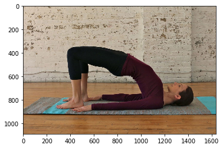

# Yoga Pose Detection

Yoga Pose Detection is a project aimed at analyzing the image inputted by user and classifying the pose out of one of the 10 yoga poses.

# Motivation

The motivation for this came project came from the quarantine and lockdowns. During these long months of lockdown it's difficult for people to go out to exercise, run and do things they can to stay fit. Yoga is something that can be done indoors easily and has a lot of benefits.
But it can be tricky to get any yoga pose correct if a person doesn't do yoga regularly.
With the help of yoga pose detection, people can not only classify the pose but also check how well is their posture as compared to a perfect yoga pose.

# Dataset
 
 The Dataset can be found under the data folder. There is a train set and a test set. The different yoga poses available in the data are:
 
 ### Yoga Poses
| Class | Label |
| --- | --- |
| 0 | bridge |
| 1 | child |
| 2 | downwardog |
| 3 | mountain |
| 4 | plank |
| 5 | seatedforwardbend |
| 6 | tree |
| 7 | trainglepose |
| 8 | warrior1 |
| 9 | warrior2 |

**The training data structure look like this** 

The reason behind choosing this dataset among others-
- It has images categorized in one of the ten yoga poses
- Is publicly available
- The length of the dataset is suitble for our task with 

# Features

For now Yoga Pose Detector can accpet any image from the user and classify it into one of the 10 predefined yoga poses. The predicted label is a string telling the yoga pose the person is trying.

## Used Libraries
- [Keras](https://keras.io/)- This is the main library used in this project. The model is entirely build on Keras including all the image augmentation, transfer learning, training, testing.

- [NumPy](http://numpy.org/docs)- Used for pixels manipulation

- [Matplotlib](http://matplotlib.org/)- To plot images and loss plots.

- [Flask](https://flask.palletsprojects.com/)- Used for deploying our classification model

## Network Architecture
The motivation of using transfer learning for out task came after we implemented a Deep Neural Network from Scratch. The model build from scratch gives accuracy only around 18%-20%. We can boost the accuracy with the help of transfer learning.

Keras application module has variety of pretrained networks which can be easily downloaded.

In our project, we tried multiple networks before settling to MobileNet.

## Model
The pretrained models are trained on the ImageNet Dataset classifying 1000 classes. Our task is to classify the yoga pose in one of the 10 classes, so we modified the classification layer and replaced it with our Dense layer.
The final model is a combination of transfer learning and custom trained classifier.
The training accuracy achieved is **81%** and validation accuracy acheived is **61%**.

## Performance
The model is completely built on the public free available dataset in contrast to the commercial projects that use large datasets with high resolution quality. However, the model is capable of being trained on any dataset and predicting the accurate yoga postures. 
Currently the accuracy is 61% which can be improved with diverse datasets.

# Future Work:

1. **Adding real time prediction feature**, so that person can perform yoga infront of the webcam and yoga pose detector can classify the pose in real time
2. **Adding scoring feature to tell how well your yoga posture is** Comparing the perfect pose with user's pose will help user to improve by correcting their posture.
3. **Adding Style Transfer**. The person will be able to add stylish backgrounds to their image.

## License
[**MIT License**](https://choosealicense.com/licenses/mit/)

***Inspired by 2020 MLH Fellowship Mini Hackathon Contest***.
